# 中证生物医药指数预测 - 399441
注意：仅供技术交流，切勿盲目跟随；

时间周期选取自2020年至2026年7月按日提取的收盘价、开盘价、最高价、最低价、交易量数据

## 一、探索

### 1.1价格走势

#### 2020年至下半年价格持续增长，21年前后维持高位震荡，之后一路下行至24年底维持低位

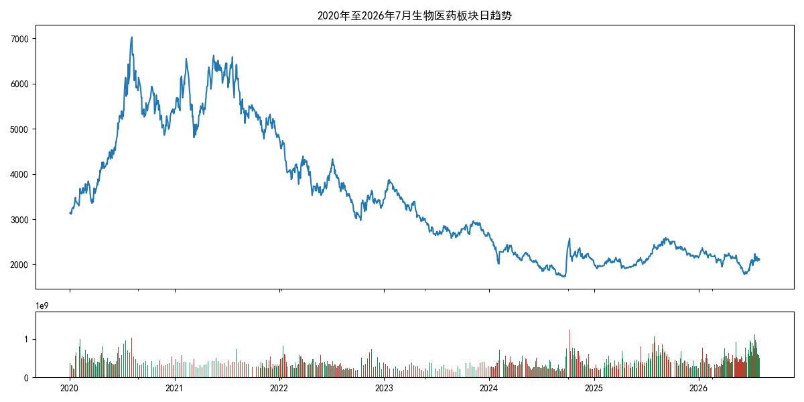

### 1.2收益和交易量分布

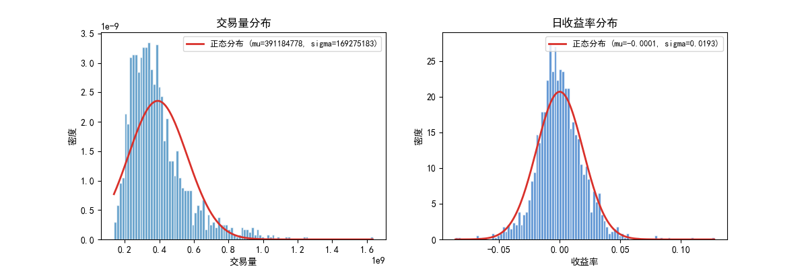

### 1.3收益率QQ图

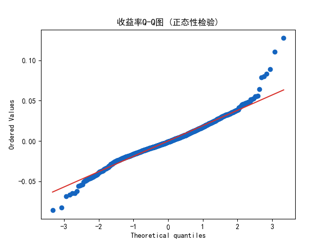

### 1.4孤立点情况

#### 交易量和收益月度离群点情况

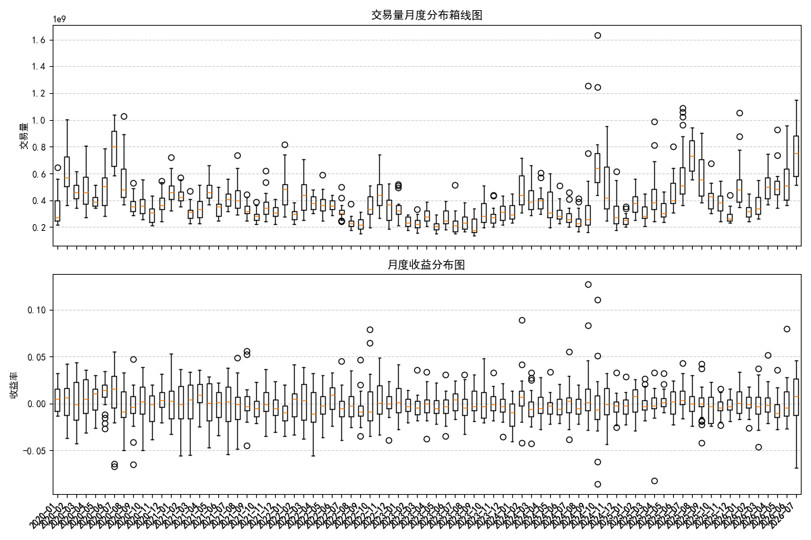

#### 95%的置信区间检测出的点很好的落在出现转折信号附近

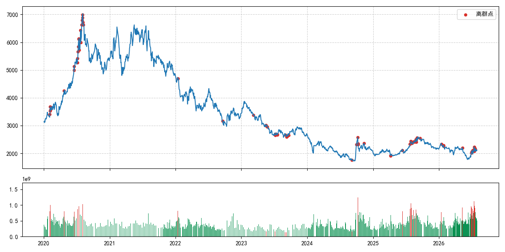

### 1.5特征相关情况

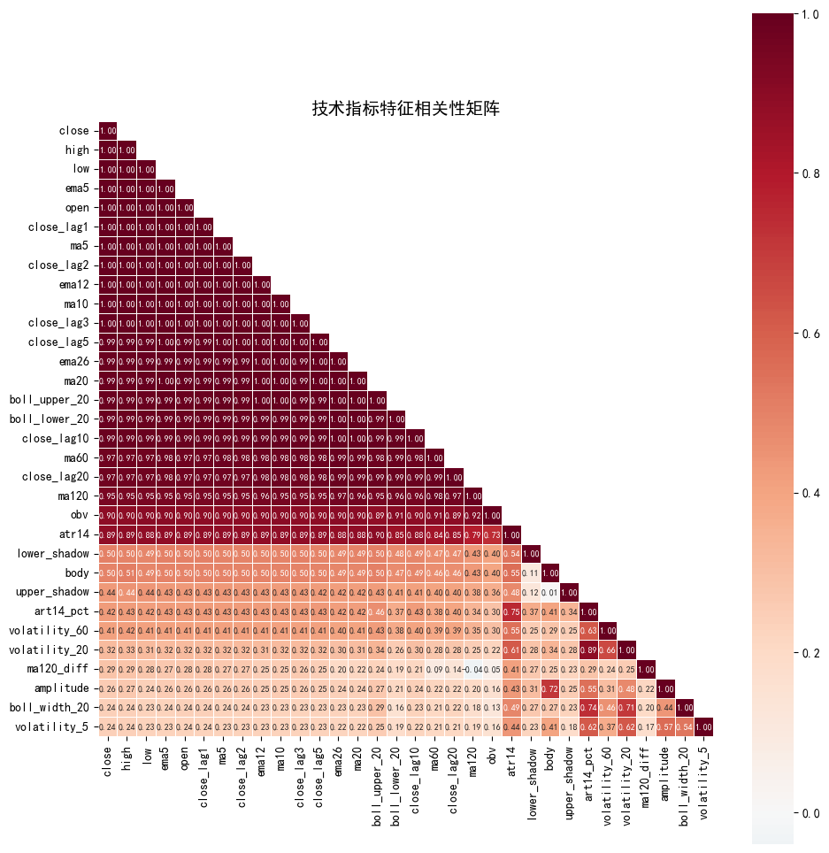

## 二、时间序列分析

### 2.1单变量时间序列

#### 2.1.1收盘价一阶差分和二阶差分

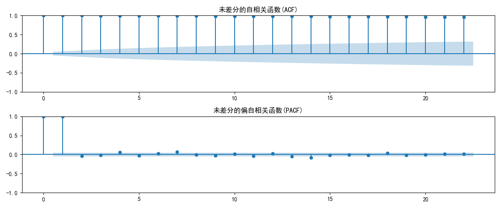

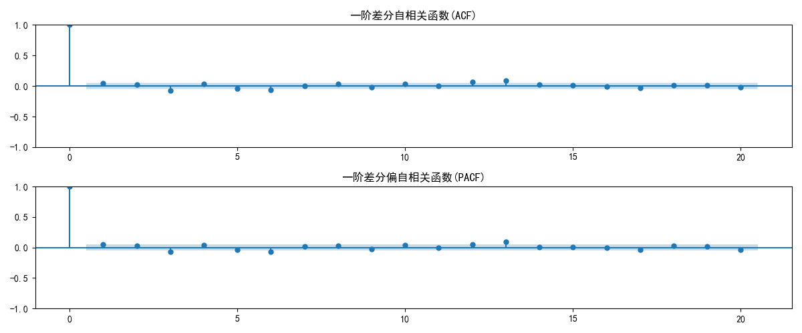

#### 2.1.2平稳性检验
- 原始序列 p=0.7397 >0.05 → 序列非平稳
- 一阶差分序列 p=0.0000 ≤0.05 → 序列平稳
- 一阶差分+季节差分 p=0.0000 ≤0.05 → 序列平稳

#### 2.1.3时间序列分解

- 趋势成分
- 季节成分
- 残差成分

#### 2.1.4ARIMA模型建模

> Best model:  ARIMA(0,True,1)(3,True,0)[22] 

> Jarque-Bera 统计量: 790190.8; P-value: 0.0000;  拒绝正态性假设 (残差存在尖峰厚尾，在金融数据中非常常见)

模型评估结果
|MAE|MSE|MAPE|
|-----|-----|-------|
|153.68|170.32|7.74%|

#### 2.1.5残差检验

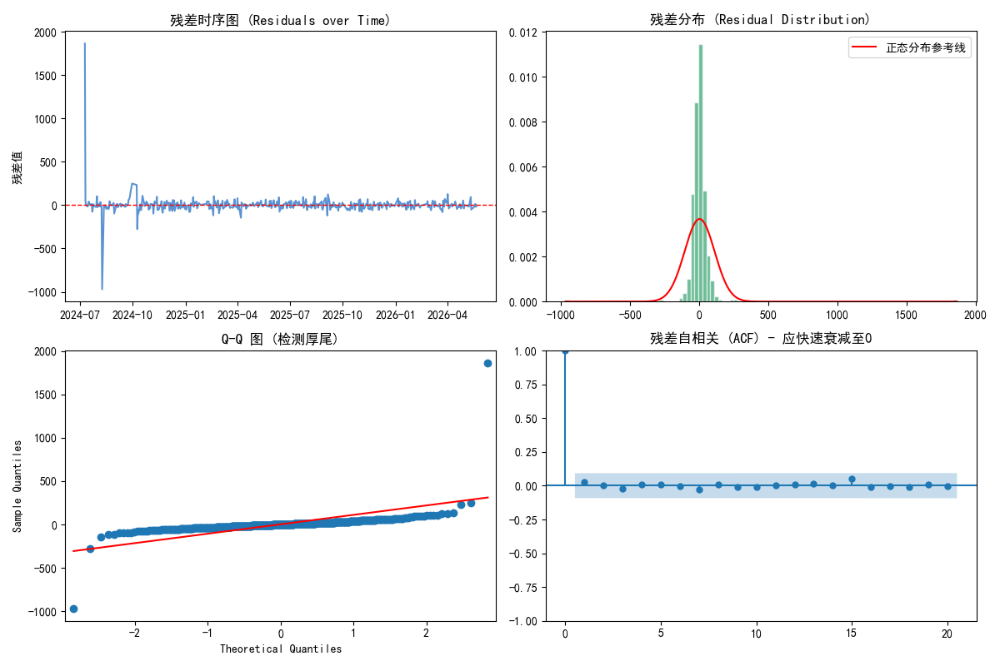

#### 残差时序图

- 残差大致围绕零均值上下波动，无明显单调趋势或周期性，说明模型对趋势和季节性的拟合基本合理。
- 但残差的波动幅度并非恒定，某些时段波动明显增大（如2026年后），表明可能存在波动聚集效应（条件异方差），这是金融时间序列的常见特征，也暗示后续可引入GARCH类模型。
- 没有出现明显的异常离群点持续偏离，说明模型整体稳定

#### 直方分布图

- 直方图显示残差分布中心较高、尾部较厚，相对于正态曲线呈现尖峰厚尾形态。
- 这说明残差不服从正态分布，与Jarque-Bera检验（p≈0）结果一致。金融收益率的残差通常具有这种特征，属于正常现象，但意味着基于正态假设的预测区间会偏窄，后续可采用分位数回归或历史模拟法进行区间预测。

#### QQ图

- 图中点在中部大致沿直线分布，但在两端（尤其是尾部）明显偏离直线，左尾下偏、右尾上偏，进一步证实了厚尾特征。
- 这再次确认残差非正态，但Q-Q图对尾部偏差更敏感，有助于判断极端值风险。

#### 残差自相关

- 绝大多数滞后的自相关系数都落在95%置信区间内（蓝色区域），且无显著超出边界的值。
- 结合Ljung-Box检验（Q统计量p≈0.97），说明残差序列不存在显著自相关，即模型已经充分提取了数据中的线性相关性，残差表现为白噪声。
- 这是模型诊断中最重要的指标，表明ARIMA结构设定合理，信息提取充分。

#### 2.1.6 标准化残差

数据存在条件异方差效应，引入GARCH模型

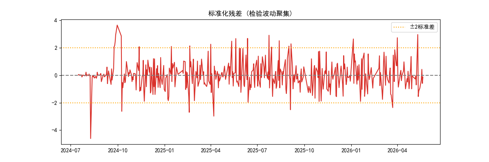

- 参数显著性：ω、β₁、ν 的 p 值都小于 0.05，估计显著。

- 波动持续性：α + β = 0.3016742 + 0.5959155 = 0.89759，小于 1，满足平稳性条件，表明波动冲击以较慢速度衰减。

- 自由度 ν = 4.18，明显小于正态分布（ν→∞），说明残差尾部较厚，采用 t 分布是合理的。

#### 2.1.7波动率预测

覆盖率仅为 38%，远低于 95% 的理论值，模型对预测区间严重低估

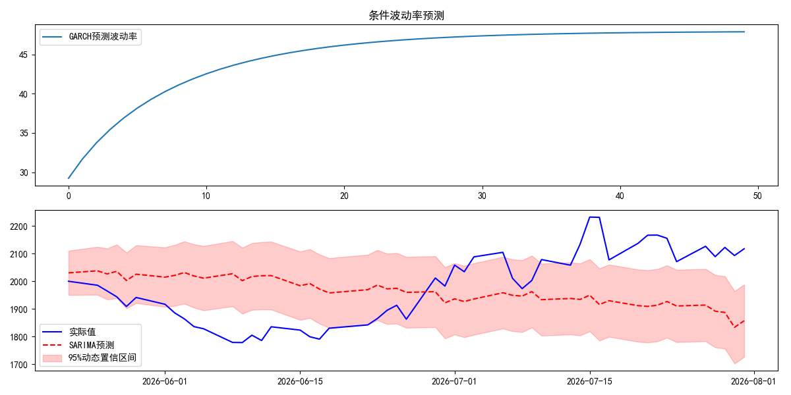

### 2.2、多变量时间序列

#### 2.2.1平稳性

原始序列非平稳序列，一阶差分序列平稳

|name|statistic|p_value|critical_1% |critical_5% |critical_10% |stationary|
|------|--------|--------|-------------|------------|-------------|-----------|
|close|-10.13|8.50e-18|-3.434834 |-2.863520| -2.567824 |True|
|volume|-16.2210|3.85e-29|-3.434828 |-2.863518|-2.567823 |True|
|rsi14|-14.71|2.84e-27|-3.434837 |-2.863522 |-2.567825 |True|
|boll_width_20|-12.11|1.92e-22|-3.434855 |-2.863530|	-2.567829|True|
|volatility_20|-14.09|2.64e-26|-3.434855 |-2.863530 |-2.567829 |True|

#### 2.2.2格兰因果试验

|NAME|MIN_P_VALUE|BEST_LAG|CAUSES|
|----|-----------|--------|------|
|         volume|       0.37|      1.0|  0.00|
|          rsi14|       0.23|      3.0|  0.00|
|  boll_width_20|       0.02|      3.0|  1.00|
|  volatility_20|       0.12|      1.0|  0.00|

#### 2.2.3VAR模型

|MAE|RMSE|MAPE|
|-----|-------|------|
|149.35|166.86|7.49|

#### 2.2.4残差检验

## 三、机器学习模型

### 3.1各模型结果

|NAME  |MAE   |RMSE  |MAPE  |
|---------|-------|--------|--------|
|   xgb| 34.19| 46.36|  1.58%|
|    rf| 36.84| 49.76|  1.66%|
| ridge| 29.38| 39.44|  1.36%|
|  lstm| 56.30| 73.05|  2.65%|

### 3.2树模型重要参数

#### XGB模型重要参数

|feature|importance|
|--------|------------|
|high|0.341030|
|close_lag2|0.335545|
|low|0.104762|
|ema26|0.051492|
|ma5|0.047903|
|ma20|0.040155|
|ema5|0.025114|
|ma60|0.020754|
|open|0.006373|
|close_lag3|0.006360|

#### RANDOMFOREST模型重要参数

|feature|importance|
|--------|------------|
|high|0.599920|
|low|0.299599|
|open|0.030261|
|close_lag1|0.024323|
|ma5|0.018954|
|ema5|0.009570|
|close_lag2|0.002612|
|ma120|0.002195|
|ma20|0.002160|
|ma10|0.002155|

### 3.3反MPAE模型加权

|XGB|RF|RIDGE|LSTM|
|-----|---|------|------|
|0.2698|0.2562|0.3132|0.1607|

### 3.4各模型拟合结果

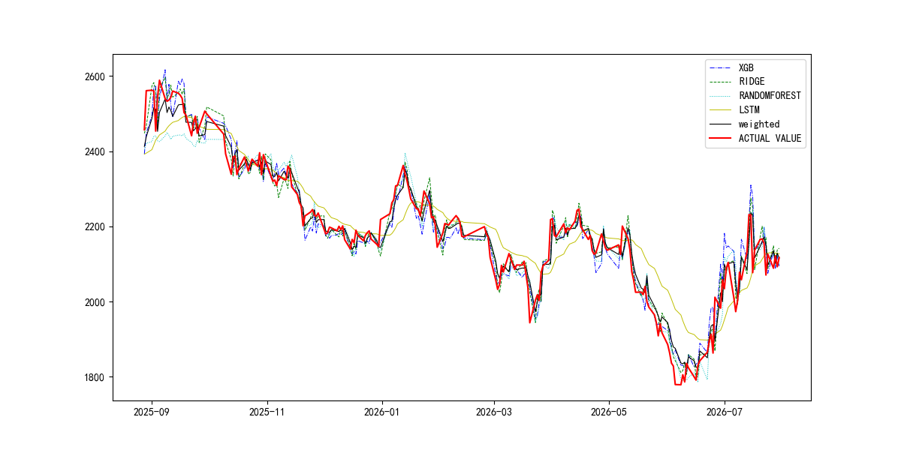