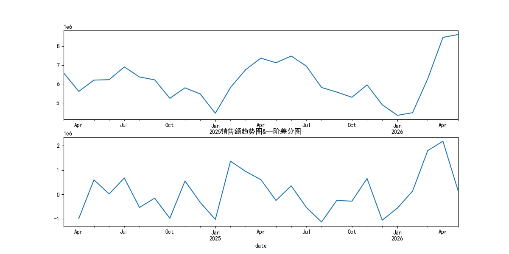
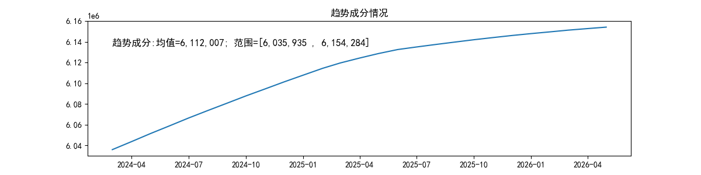
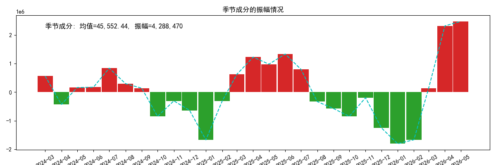
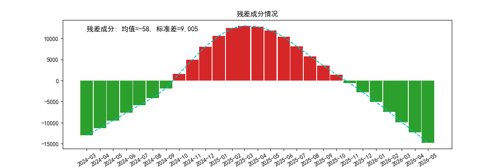
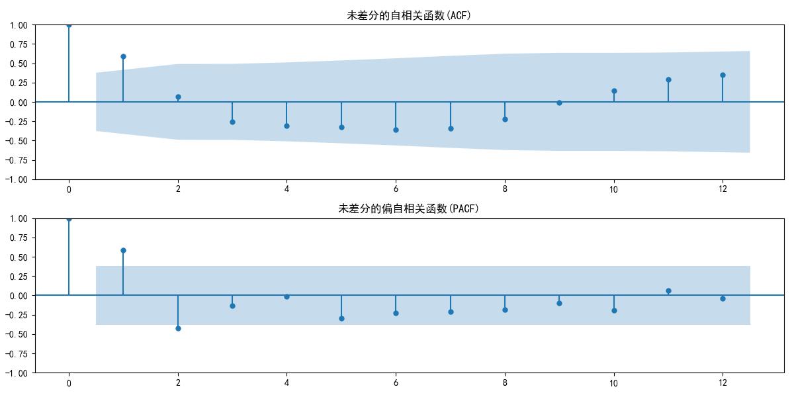
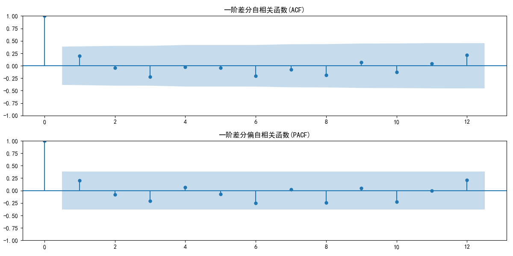

## 时间序列分析

基于时间序列构建模型预测未来5个月的销售额情况
[![项目入口]]()

### 一、描述性分析
#### 1.1基础数据情况
> 统计数量、均值、标准差、最小值、最大值

#### 1.2销售额趋势
> 

#### 1.3年度汇总
整体变异系数17.77%，数据相对稳定
|date	|mean	|sum	|std	|min	|max	|cv	|
|-----------|-----------|-----------|-----------|-----------|-----------|----------|
|2024	|	|	|	|	|	|8.617	|
|2025	|	|	|	|	|	|16.34	|
|2026	|	|	|	|	|	|32.20	|

变异系数逐年上升，反映波动加剧，后续可使用乘法季节性

### 二、时间序列验证

#### 2.1趋势成分
长期趋势明显，数据在常周期内呈现持续上升

#### 2.2季节成分

#### 2.3残差成分
残差数据带有强烈、非线性的趋势

#### 2.4自相关和偏自相关
数据没有长期上涨或下跌的惯性（均值回归很快，快速接近0），序列围绕一个恒定均值波动

