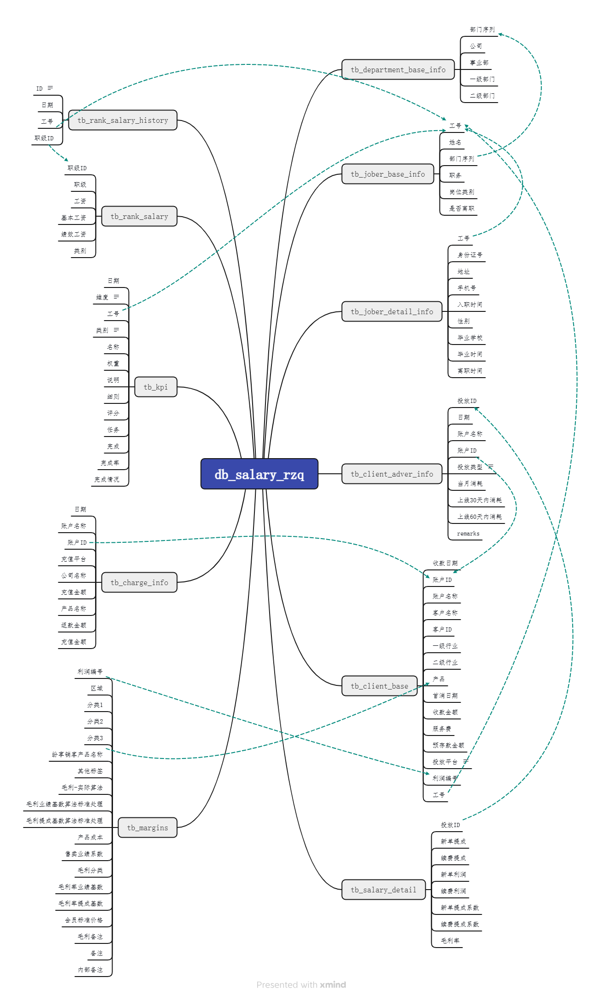
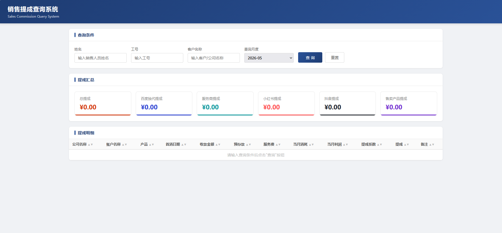

# 销售提成查询

包括数据库创建、数据导入以及查询内容

## 一、索引
### SalesConsumptionQuerry
#### code
- commission_query_system.py # 查询
- dataLoading.py # 原始数据载入
- modifyFile.py # 载入数据的SQL
#### SQL
- creat_databases.sql # 数据库创建
- creat_veiw.sql # 创建视图

## 二、数据库创建

## 三、查询
- 索引网址：http://127.0.0.1:5000

